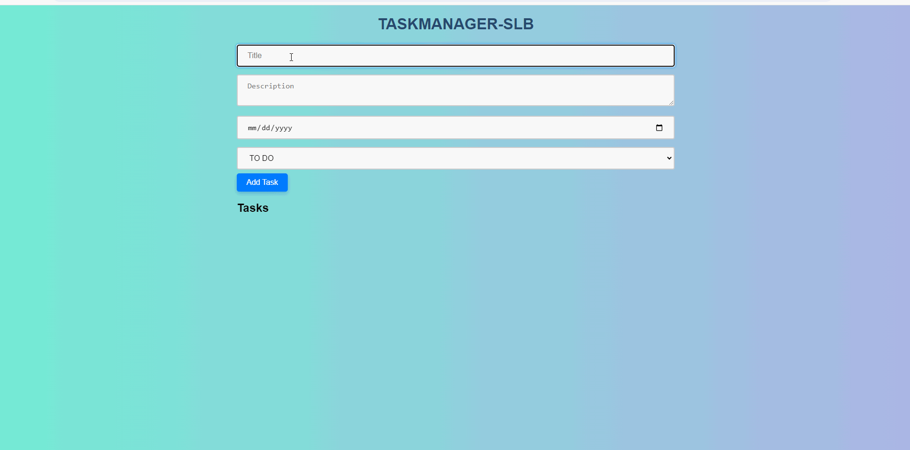

# SLB-TaskManager by Liu Nazhou

## Description

A simple web application for managing tasks. Support for creating, updating, and deleting tasks. The backend is implemented using Flask and the frontend is implemented using React.

## Installation

Warning: Please start backend server first before starting frontend page.

### Backend

1. Navigate to the backend directory:
    ```
    cd backend
    ```
2. Create virtual environment:
    ```
    python -m venv venv
    ```
3. Install the required dependencies:
    ```
    pip install -r requirements.txt
    ```
4. Run the backend server:
    ```
    python server.py
    ```

Disclaimer: In local development evironment, python3 version is 3.10

### Frontend

1. Navigate to the frontend directory:
    ```
    cd taskmanager-frontend
    ```
2. Install the required dependencies:
    ```
    npm install
    ```
3. Run the frontend server:
    ```
    npm run start
    ```
### Testing

warning: test.py can only be run if no tasks are created in the database.

1. Navigate to the backend directory:
    ```
    cd backend
    ```
2. Run the tests:
    ```
    python tests.py
    ```

### preview

